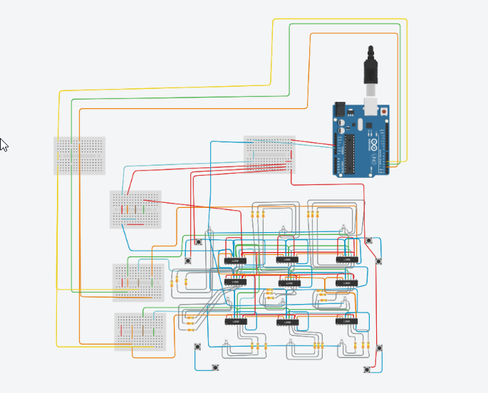

  
  
                  Led Rubik Cube
                
 
 1.) Componenets : 
 
        - 5mm RGB LED x 54 ( common cathod )
        - lots of 330 or (220 + 100 ) Ohm Resistor
        - 74HC595 8-bit Shift Register x 54
        - pushbutton x48
        - Arduino Uno
        - lots of wires

        
        
        

      
 
 2.)  Purpose :
 
         - rubik cube principle
         - you can move a column / row with the button associated ( the one next to that column or row )
         - there are more pushbuttons that do the same thing, but this approach seems to be more intuitive
         - the purpose is to arrange all leds on all faces so that they are the same color
         - there are  8 colors to choose from: Red, Green, Blue, Yellow(RG), Violet(RB), Teal(BG), and White(RGB)
         
 
3.) Software part :
 
         - operate the cube we create a 54-byte array 
         - the bytes of the array will get shifted out immidiately
         - rotations are executed by swapping array values and then shifting out the array again
         - RGB LED always corresponds to the same index in the array
         - the cube has six faces and we can take any face and rotate in one of two directions
          - we decided on 8 buttons per face, so that we can rotate either of the four edges of that face in either direction
  
  
  
  4.) Hardware part :  
       
       - i designed an electrical scheme on Tinker ( the exported project can be found in repo under the name "SchemaElectrica" : 
       
         
        - example of others electrical schemes:
          
          

        
        - the scheme of one face : 
          
          
          
          - final one should look like this :
          

          
        
    
   - 5.) Tutorials :
        - ShiftOut tutorial : https://www.arduino.cc/en/Tutorial/ShiftOut
        - Led cube tutorials : 
            - https://create.arduino.cc/projecthub/ArduinoKoen/rubik-s-cube-bc1b50
            - https://blog.adafruit.com/2015/05/25/led-rubiks-cube-with-arduino/
            - https://www.htxt.co.za/2017/10/25/try-and-solve-the-rubiks-cube-thats-also-an-arduino-led-lamp/
